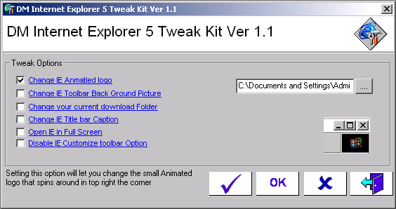



## IE Tweak V1

### Description

IE Tweak is a small project I made that will let you change things on Internet Expolrer 5 Like the Logo and change the Back Ground and add your Own Caption and also do other things. It's Still not all comleate at this stage but i will be adding more things to it soon. Please Vote if you Like it.
 
### More Info
 

             |
---                |---
**Submitted On**   |2001-03-18 17:53:44
**By**             |[dreamvb](https://github.com/Planet-Source-Code/PSCIndex/blob/master/ByAuthor/dreamvb.md)
**Level**          |Beginner
**User Rating**    |4.3 (13 globes from 3 users)
**Compatibility**  |VB 6\.0
**Category**       |[Internet/ HTML](https://github.com/Planet-Source-Code/PSCIndex/blob/master/ByCategory/internet-html__1-34.md)
**World**          |[Visual Basic](https://github.com/Planet-Source-Code/PSCIndex/blob/master/ByWorld/visual-basic.md)
**Archive File**   |[CODE\_UPLOAD15740322001\.zip](https://github.com/Planet-Source-Code/dreamvb-ie-tweak-v1__1-21473/archive/master.zip)

